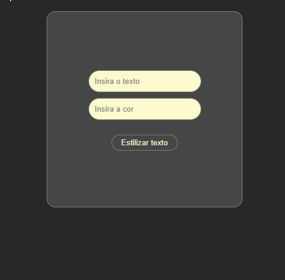

# ColorUpper


# Propósito do Projeto

Este projeto tem como objetivo proporcionar uma prática valiosa para o desenvolvimento da lógica de programação, enquanto ao mesmo tempo exercita a criatividade na criação de nomes significativos para os componentes. O foco principal é escrever código limpo e legível, eliminando a necessidade de excessivos comentários.

## Descrição do Componente

O componente desenvolvido é uma solução simples que recebe um texto e uma cor como entrada e o transforma para letras maiúsculas. Além disso, permite que o usuário defina a cor do texto, seja por meio de uma palavra (como 'red') ou utilizando um código hexadecimal.

## Funcionalidade

1. **Nome do Componente:** Transform
2. **Props:**
   - `texto`: O texto que será transformado para maiúsculo.
   - `corTexto`: A cor desejada para o texto (pode ser uma palavra como 'red' ou um código hexadecimal).

Ao clicar no botão de envio o texto já aparecerá com as alterações de acordo com as props recebidas.

## Ferramentas utilizadas

1. **Vs Studio Code;**
2. **React;** 
3. **CSS3;**
4. **GIT;**
5. **JavaScript.** 

## Como utilizar

1. Clone o repositório:

    ```bash
    git clone https://github.com/Paulo-Heber/ColorUpper.git
    ```

2. Certifique-se de ter o Node.js instalado. Você pode baixá-lo em [Node.js website](https://nodejs.org/).

3. Abra o terminal dentro da pasta do projeto e instale as dependências utilizando o npm:

    ```bash
    npm install
    ```

4. Após a instalação das dependências, inicie o projeto executando o seguinte comando:

    ```bash
    npm run dev
    ```

    Este comando iniciará o projeto e abrirá a aplicação no seu navegador padrão.

